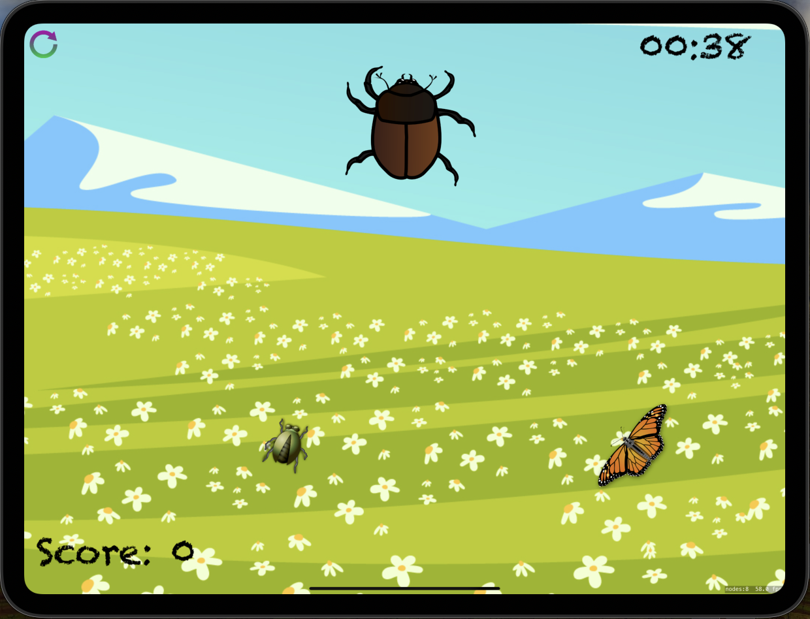
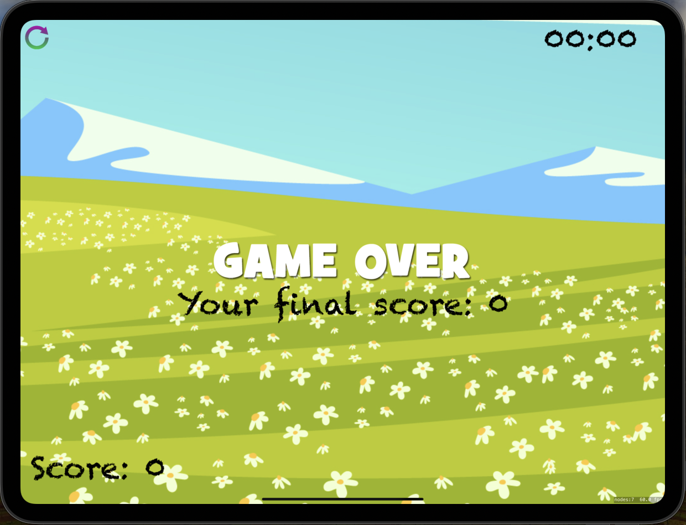

# ShhotingGallery

ShhotingGallery is a simple iOS game that tests the player's accuracy and speed.

## Table of Contents

* [Features](#features)
* [Screenshots](#screenshots)
* [Requirements](#requirements)
* [Usage](#usage)
* [Code Overview](#code-overview)

## Features

* Tests the player's accuracy and speed by shooting at moving targets.
* Tracks the player's score and displays it on the screen.
* Includes a countdown timer that ends the game when it reaches zero.
* Allows the player to restart the game after it ends.

## Screenshots

  
   
  <em>Gameplay Screen</em>

  
   
  <em>Game Over Screen</em>

## Requirements

* iOS 12.0+
* Xcode 12.0+
* Swift 5.0+

## Usage

1. Launch the app.
2. Tap on the screen to shoot at moving targets.
3. Avoid missing targets to increase your score.
4. Watch out for the countdown timer, which ends the game when it reaches zero.
5. Restart the game when it ends.

## Code Overview

### GameScene

* Manages the game scene, including creating and updating sprites, handling user input, and displaying game information.
* Includes methods to handle game logic, such as creating sprites, updating the game timer, and handling user input.

### Other classes

* The other classes in this project include SKSpriteNode, SKEmitterNode, and SKLabelNode, which are used to create and display sprites, emitters, and labels on the screen.
